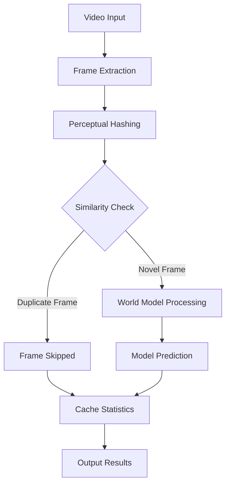

# WorldCache CLI – Deduplicate video frames before your world model sees them

> *Made autonomously using [NEO](https://heyneo.so) · [](https://marketplace.visualstudio.com/items?itemName=NeoResearchInc.heyneo)*

[](https://www.python.org/)
[](tests/)
[](LICENSE)
[](https://github.com/dakshjain-1616/worldcache-cli)

**WorldCache slashes the number of frames your world model processes by 70–90% — with zero changes to the model itself.**

## Quickstart

```python
from worldcache import VideoProcessor
from worldcache.hasher import HashAlgorithm

# Initialize processor with default settings
processor = VideoProcessor(
    similarity_threshold=0.92,
    algorithm=HashAlgorithm.DHASH,
    window_size=32,
)

# Process a directory of frames
result = processor.process_directory("frames/", output_dir="cache/")

print(f"Cache hit rate: {result.cache_hit_rate:.1%}")
print(f"RAM reduction: {result.ram_reduction_pct:.1f}%")
print(f"Frames saved: {result.cached_frames}/{result.total_frames}")
```

## Example Output

```json
{
  "source": "frames/",
  "total_frames": 1800,
  "anchor_frames": 216,
  "cached_frames": 1584,
  "cache_hit_rate": 0.88,
  "ram_reduction_pct": 88.0,
  "bytes_saved": 456192000,
  "elapsed_seconds": 3.42,
  "output_dir": "cache/",
  "output_files": ["metadata.json", "anchors.npz"]
}
```



## The Problem

World models — autoregressive video prediction and generation models like [Genie](https://deepmind.google/discover/blog/genie-generative-interactive-environments/), [UniSim](https://universal-simulator.github.io/), and [WorldDreamer](https://worlddreamer.github.io/) — are among the most compute-intensive architectures in modern AI. A single forward pass can consume hundreds of milliseconds and gigabytes of GPU memory.

Real video is brutally redundant. At 30 fps, one minute of footage produces 1,800 frames. During a slow camera pan, a static office scene, or a character standing still, consecutive frames can differ by less than 1% of their pixels. Feeding every one of those frames to a world model is pure waste.

WorldCache sits in front of your world model as a lightweight perceptual cache. Before each frame is processed, WorldCache computes its perceptual hash and compares it against a sliding window of recently-seen anchor frames. If the new frame is too similar to a recent anchor — above your configured threshold — it is marked as a cache hit and skipped entirely. Only genuinely novel frames (anchors) are forwarded to the model.

No GPU. No retraining. No changes to your model architecture. Just a thin preprocessing layer that pays for itself immediately.

## Install

```bash
git clone https://github.com/dakshjain-1616/worldcache-cli
cd worldcache-cli
pip install -r requirements.txt
pip install -e .
```

> **MP4 support:** By default, WorldCache processes directories of image frames (JPEG/PNG). To process `.mp4` files directly, uncomment `opencv-python` in `requirements.txt` and reinstall.

**Requirements:** Python 3.8+, Pillow>=9.5, numpy>=1.24, click>=8.1, rich>=13.4. No GPU required.

## CLI Quickstart

WorldCache provides four commands.

### 1. `process` — deduplicate a frame directory or video file

```bash
# Process a directory of image frames
worldcache process frames/ --threshold 0.92 --output-dir cache/

# Process an .mp4 file (requires opencv-python uncommented in requirements.txt)
worldcache process input.mp4 --threshold 0.90 --output-dir cache/ --algorithm phash

# Verbose output: print per-frame status
worldcache process frames/ --threshold 0.92 --output-dir cache/ --verbose
```

The command writes anchor frames and a `metadata.json` summary to `--output-dir`.

**Options:**

| Flag | Short | Default | Description |
|------|-------|---------|-------------|
| `--threshold` | `-t` | `0.92` | Similarity threshold 0.0–1.0. Higher = less aggressive deduplication. Frames with similarity ≥ threshold are skipped. |
| `--output-dir` | `-o` | *(required)* | Directory to write anchor frames and metadata JSON. |
| `--algorithm` | | `dhash` | Hash algorithm: `dhash`, `phash`, `ahash`, `whash`. See [Hash Algorithms](#hash-algorithms). |
| `--window-size` | | `32` | Sliding window of recent anchor frames to compare against. |
| `--verbose` | `-v` | off | Print per-frame hit/miss status to stdout. |

### 2. `demo` — run on synthetic frames without a video file

```bash
worldcache demo --frames 200
```

Generates 200 synthetic frames internally and runs the full deduplication pipeline, printing a results table. Useful for verifying your installation and exploring threshold behavior.

### 3. `inspect` — examine results from a previous run

```bash
worldcache inspect --cache-dir cache/
```

Reads the `metadata.json` written by a previous `process` run and prints a detailed summary: total frames, anchor count, cache hit rate, bytes saved, and elapsed time.

### 4. `benchmark` — compare hash algorithms side-by-side

```bash
worldcache benchmark frames/ --algorithms dhash,phash,ahash
```

Runs each specified algorithm over the same frame set and prints a comparison table of cache hit rate, speed, and anchor frame count. Use this to pick the right algorithm for your footage.

## Python API

### Processing a directory

```python
from worldcache import VideoProcessor
from worldcache.hasher import HashAlgorithm

processor = VideoProcessor(
    similarity_threshold=0.92,
    algorithm=HashAlgorithm.DHASH,
    window_size=32,
)
result = processor.process_directory("frames/", output_dir="cache/")

print(f"Cache hit rate: {result.cache_hit_rate:.1%}")   # e.g. 78.4%
print(f"RAM reduction:  {result.ram_reduction_pct:.1f}%")
print(f"Frames saved:   {result.cached_frames}/{result.total_frames}")
print(f"Bytes saved:    {result.bytes_saved:,}")
print(f"Elapsed:        {result.elapsed_seconds:.2f}s")
```

### Integrating into a world model inference loop

This is the core use case. WorldCache acts as a gate: only frames that pass the cache check reach your model.

```python
from worldcache import FrameCache
from worldcache.hasher import HashAlgorithm
import numpy as np

# Initialise the cache once before your inference loop
cache = FrameCache(
    similarity_threshold=0.92,
    algorithm=HashAlgorithm.DHASH,
    window_size=32,
)

for i, frame_array in enumerate(my_video_frames):
    # frame_array: numpy uint8 array, shape (H, W, C)
    entry = cache.process_frame(frame_array, frame_idx=i)

    if not entry.is_anchor:
        # This frame is too similar to a recent anchor — skip it
        # entry.similarity tells you how close it was (e.g. 0.97)
        # entry.anchor_idx tells you which anchor it matched
        continue

    # Only novel frames reach the world model
    prediction = world_model.predict(frame_array)
    handle_prediction(prediction)

# Print final stats
stats = cache.get_stats()
print(f"Processed {stats.total_frames} frames")
print(f"World model saw {stats.anchor_frames} frames ({stats.cache_hit_rate:.1%} skipped)")
```

### Key data classes

**`CacheEntry`** — returned by `cache.process_frame()`:

| Field | Type | Description |
|-------|------|-------------|
| `frame_idx` | `int` | Index of this frame in the source sequence |
| `is_anchor` | `bool` | `True` if this frame is novel and should be processed |
| `anchor_idx` | `int` | Index of the matching anchor (if `is_anchor` is `False`) |
| `similarity` | `float` | Similarity score 0.0–1.0 against the nearest anchor |
| `frame_hash` | `int` | Raw perceptual hash value |
| `timestamp_ms` | `float` | Processing timestamp in milliseconds |

**`CacheStats`** — returned by `cache.get_stats()`:

| Field | Type | Description |
|-------|------|-------------|
| `total_frames` | `int` | Total frames seen |
| `anchor_frames` | `int` | Frames forwarded to the model |
| `cached_frames` | `int` | Frames skipped as duplicates |
| `cache_hit_rate` | `float` | Property: `cached_frames / total_frames` |
| `total_pixels_saved` | `int` | Total pixels not processed |

**`ProcessResult`** — returned by `processor.process_directory()`:

| Field | Type | Description |
|-------|------|-------------|
| `source` | `str` | Source path |
| `total_frames` | `int` | Total frames in source |
| `anchor_frames` | `int` | Unique frames kept |
| `cached_frames` | `int` | Frames skipped |
| `cache_hit_rate` | `float` | Fraction skipped |
| `ram_reduction_pct` | `float` | Estimated RAM reduction percentage |
| `bytes_saved` | `int` | Estimated bytes not transferred to model |
| `elapsed_seconds` | `float` | Wall-clock processing time |
| `output_dir` | `str` | Output directory path |

## Hash Algorithms

WorldCache supports four perceptual hashing algorithms. All are CPU-only and run in microseconds per frame.

| Algorithm | Flag | Speed | Robustness | Best for |
|-----------|------|-------|------------|----------|
| Difference hash | `dhash` | Fast | Good | Motion detection, general use **(default)** |
| Perceptual hash | `phash` | Medium | Excellent | Brightness/contrast changes, lighting variation |
| Average hash | `ahash` | Fastest | Low | High-throughput pipelines, uniform footage |
| Wavelet hash | `whash` | Slow | Best | High-quality deduplication, slow-moving footage |

**Choosing a threshold:**

- `0.85–0.90` — aggressive deduplication; useful for mostly static scenes
- `0.92` — balanced default; works well for typical video game or robotics footage
- `0.95–0.98` — conservative; only removes near-identical frames (e.g. exact duplicates from re-encoding)

Run `worldcache benchmark` on a sample of your footage to find the right combination for your use case.

## Configuration

WorldCache reads defaults from environment variables so you can configure it once for a project without passing flags every time.

| Variable | Default | Description |
|----------|---------|-------------|
| `WORLDCACHE_SIMILARITY_THRESHOLD` | `0.92` | Default similarity threshold for `process` |
| `WORLDCACHE_WINDOW_SIZE` | `32` | Default sliding window size |

Example `.env` for a robotics dataset with slow-moving scenes:

```bash
WORLDCACHE_SIMILARITY_THRESHOLD=0.88
WORLDCACHE_WINDOW_SIZE=64
```

CLI flags always override environment variables.

## Project Structure

```
worldcache-cli/
├── worldcache/
│   ├── __init__.py       # Public API: FrameCache, VideoProcessor
│   ├── cache.py          # FrameCache: sliding-window deduplication logic
│   ├── hasher.py         # HashAlgorithm enum + perceptual hash computation
│   ├── processor.py      # VideoProcessor: directory/video file processing
│   ├── cli.py            # Click CLI: process, demo, inspect, benchmark
│   └── utils.py          # Shared utilities (frame loading, formatting)
├── tests/
│   ├── test_cache.py
│   ├── test_cli.py
│   ├── test_hasher.py
│   ├── test_processor.py
│   └── test_utils.py
├── scripts/
│   └── demo.py
├── requirements.txt
├── setup.py
└── pytest.ini
```

## Run Tests

```bash
pip install -r requirements.txt
pip install -e .
pytest tests/ -q
```

82 tests cover the cache logic, all four hash algorithms, CLI commands, and the processor pipeline.

```
82 passed
```

## License

MIT